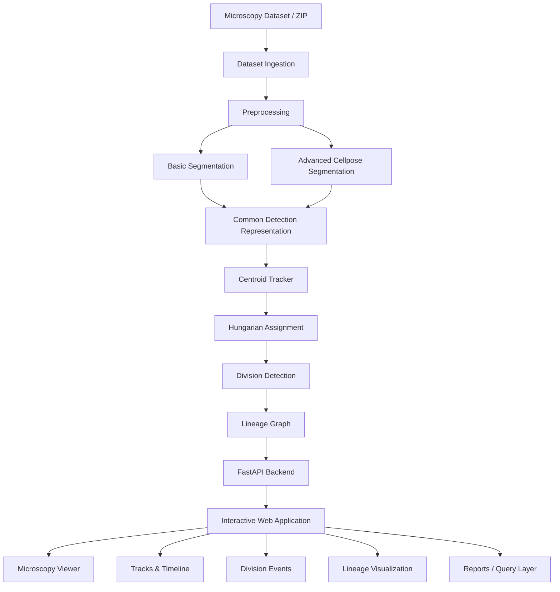

<div align="center">

# BioMap

### AI-Based 3D Microscopy Cell Detection, Tracking & Lineage Reconstruction

A college project built for the SIH internal round to turn time-lapse microscopy data into an interactive view of detected cells, tracks, divisions and lineage relationships.

<br>

<p>
  
</p>

<p>
  
  
  
  
</p>

</div>

---

# DEMO
https://github.com/user-attachments/assets/6103e15a-0b81-4c9f-a3ec-aee367c46a63

---

## About the Project

**BioMap** is our prototype for analyzing 3D time-lapse microscopy datasets and presenting the results in a form that is easier to inspect than a collection of scripts and static plots.

The system takes microscopy image sequences through preprocessing, cell segmentation, temporal tracking, division detection and lineage reconstruction. The processed results are then exposed through a web application where a researcher can move through frames, inspect detected cells and tracks, view mitosis events, and explore parent-daughter relationships.

The main idea was to keep the analysis pipeline modular while still making the final result practical enough for a short live demonstration.

> **Project context:** This project was developed for our college-level Smart India Hackathon internal round. It is a working prototype only.

---

## Pipeline

```text
Dataset
   ↓
Preprocessing
   ↓
Segmentation
   ↓
Cell Detection
   ↓
Temporal Tracking
   ↓
Division Detection
   ↓
Lineage Reconstruction
   ↓
Interactive Visualization
```

The application supports two processing paths:

| Mode | Approach | Intended Use |
|---|---|---|
| **Basic / Fast** | OpenCV, thresholding, morphology and classical segmentation | Faster local processing and quick demonstrations |
| **Advanced / AI** | Pretrained Cellpose-based segmentation | Better segmentation when GPU-backed inference is available |

Both modes are designed to return the same internal detection structure so that tracking and lineage reconstruction do not depend on the segmentation method.

---

## What We Have Implemented

- CTC-style microscopy dataset ingestion and metadata handling
- Sample dataset support and ZIP dataset upload
- 3D microscopy volume preprocessing
  - normalization
  - denoising
  - contrast enhancement
- Classical segmentation pipeline for **Basic mode**
- Cellpose integration structure for **Advanced mode**
- Cell detections containing centroid, area, mask and confidence information
- Multi-cell temporal tracking using centroid distance and Hungarian assignment
- Tracking confidence calculation
- Division-aware tracking and mitosis detection
- Parent → daughter relationship detection
- Cell lineage reconstruction as a graph
- Interactive microscopy visualization
- Interactive lineage visualization
- Temporal timeline with:
  - frame navigation
  - playback
  - division-event markers
- Basic / Advanced processing selection
- Frontend ↔ FastAPI backend integration
- Pipeline results reflected dynamically in the UI
- Anomaly report generation after pipeline execution
- Query-response layer currently under development

---

## System Architecture



---

## Detection, Tracking and Lineage

A detected cell carries information such as:

```text
Detection
├── detection_id
├── centroid
├── area
├── mask
└── confidence
```

Tracking is performed using centroid-based association with Hungarian assignment and a maximum-distance constraint.

Each track stores its position history, frame history, area information, detection IDs, confidence history and missed-frame information.

For division detection, the pipeline considers:

- parent-track termination
- appearance of two nearby daughter tracks
- temporal proximity
- spatial proximity
- daughter-track persistence
- area consistency when available

The resulting lineage is represented as a graph:

```text
Parent Cell
├── Daughter Cell A
└── Daughter Cell B
```

This graph can be serialized and consumed directly by the frontend.

---

## Microscopy Data

The prototype has mainly been tested with datasets following the **Cell Tracking Challenge (CTC)** structure, including:
- `Fluo-N3DH-CHO`
- `Fluo-C3DL-MDA231`


---

## Advanced Segmentation: THE DEEP LEARNING PIPELINE

For the advanced pipeline, we chose **CELLPOSE** over other competitors like StarDIst (limited to star-convex shaped cells, 3D U-Net / U-ResNet (perfect for 3D tracking and accuracy, but most intensive to process, we simply couldn't do it on-browser+locally).
Cellpose was chosen because it gives us a pretrained, microscopy-specific instance segmentation model without requiring us to train a large network ourselves, and it retains accuracy to some extent while giving us efficiency and speed. Fundamentally, traditional Cellpose is a CNN-based encoder-decoder segmentation network.

For the tested CHO workflow, a 3D microscopy frame is converted to a **2D maximum-intensity projection (MIP)** before Cellpose segmentation. This gives us an AI-assisted segmentation path without requiring full volumetric 3D inference for every run.

So, while BioMap accepts and preprocesses 3D microscopy volumes, the current Cellpose implementation should **not** be described as true volumetric 3D Cellpose segmentation.

---

## Experimental Result

One Cellpose experiment on `Fluo-N3DH-CHO`, evaluated against the available ST reference, produced:

| Metric | Result |
|---|---:|
| Ground-truth cells | 10 |
| Predicted cells | 11 |
| Precision | 90.9% |
| Recall | 100.0% |
| F1 Score | 95.2% |

---

## Project Structure

The analysis code is organized around separate pipeline responsibilities:

```text
src/
├── data/
├── segmentation/
├── tracking/
└── lineage/

app/
└── application / web-facing code

experiments/
└── earlier experiments and reference implementations
```

The `experiments/` directory contains exploratory work. Production logic is progressively moved into the modular pipeline instead of being directly copied from experiment scripts.

---

## Tech Stack

| Area | Technologies |
|---|---|
| Core language | Python |
| Backend API | FastAPI |
| Image processing | OpenCV |
| AI segmentation | Cellpose |
| Numerical processing | NumPy |
| Tracking | Centroid tracking + Hungarian assignment |
| Data format | TIFF / CTC-style microscopy datasets |
| Development | VS Code, Git, GitHub |
| Environment | Linux / Google Colab or Kaggle GPU when required |

---

## Team

Built by our college team for the Smart India Hackathon internal round.

---

## LICENSE

uses the GPL v3.0 LICENSE. [Click Here](LICENSE) for more details.

---
